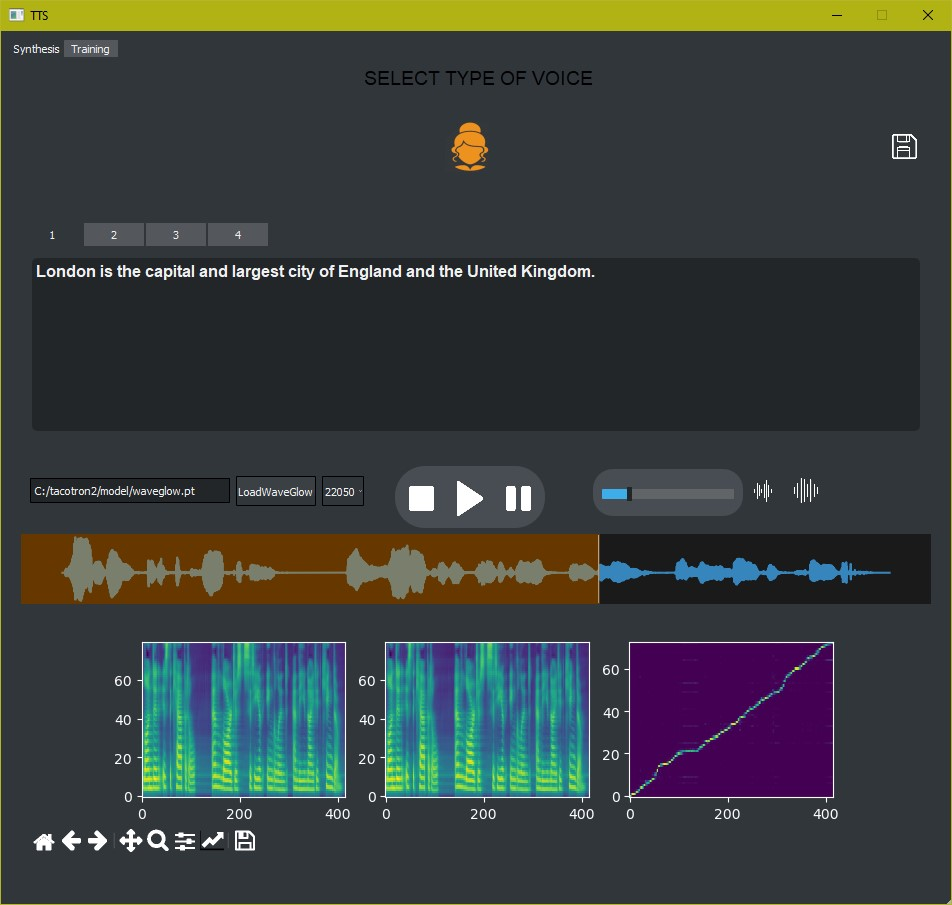

# Qt-Python-TextSpeechSynthesisInterface-Tacotron2
 Interface for speech synthesis using Tacotron2 and WaveGlow

​

 The program presents a user interface for speech synthesis [Tacotron2](https://github.com/NVIDIA/tacotron2) and [WaveGlow](https://github.com/NVIDIA/waveglow)

 For teaching English - [LJ Speech dataset](https://keithito.com/LJ-Speech-Dataset/)

 DataModel [Tacotron 2](https://drive.google.com/file/d/1c5ZTuT7J08wLUoVZ2KkUs_VdZuJ86ZqA/view) and [WaveGlow](https://drive.google.com/file/d/1rpK8CzAAirq9sWZhe9nlfvxMF1dRgFbF/view) Taken from [Nvidia](https://github.com/NVIDIA/tacotron2)